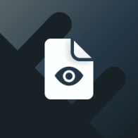

  

<h3 align="center"> cordova-outsystems-file-viewer</h3>

  

    OutSystems' Cordova Plugin for File Management.
     
    <a href="https://github.com/ionic-team/capacitor-file-viewer">🔌 Capacitor Plugin</a>
    ·
    <a href="https://github.com/ionic-team/ion-android-fileviewer">🤖 Android Library</a>
    ·
    <a href="https://github.com/ionic-team/ion-ios-fileviewer">🍏 iOS Library</a>
  

  

    <a href="https://github.com/ionic-team/cordova-outsystems-fileviewer/issues/new?labels=bug&template=bug-report.md">🐛 Report a Bug</a>
    ·
    <a href="https://github.com/ionic-team/cordova-outsystems-fileviewer/issues/new?labels=enhancement&template=feature-request.md">   💡 Request a Feature</a>
  

This project has two packages:

- the [cordova plugin](/packages/cordova-plugin/), `com.outsystems.plugins.fileviewer`.
- a [wrapper](/packages/outsystems-wrapper/) consumed by the OutSystems' low-code module, `outsystems-wrapper`.

